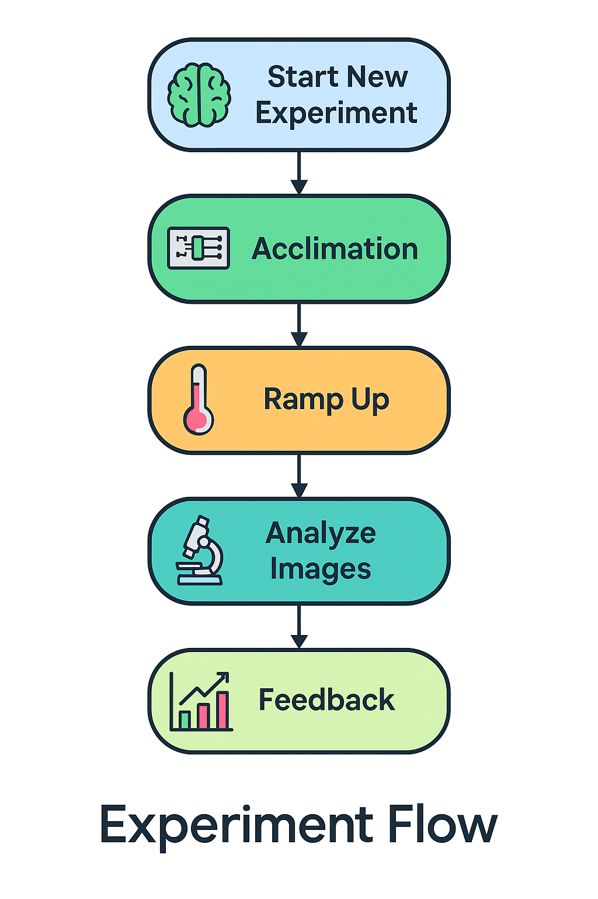

# 🧬 Yeast Control Panel – Intelligent Web-Based Experiment Manager

This system is inspired by the Moran process, focusing on the behavior of a single cell within its population. Through real-time microscopy and fluorescence analysis, it identifies a specific yeast cell and monitors its GFP and RFP expression every 5 minutes. This allows dynamic experimental control based on the cell’s phenotype in relation to the group.

The platform provides a full-stack web interface—built with Flask, HTML/JS, and Python—to manage live, image-based yeast experiments. These experiments involve temperature acclimation, fluorescence tracking (GFP), and real-time feedback loops, offering researchers a powerful tool for precision control in dynamic biological environments.

---

## 🧪 What Is This Experiment?

This experiment explores the ability of yeast populations to "solve" a problem that has no natural solution. Using a library of genetically engineered yeast strains, each expressing GFP-tagged genes unrelated to temperature stress, the system applies selective pressure: cells are grown at a constant high temperature (39°C), which constitutes a stress condition.

A randomly selected microfluidic well containing ~250–300 yeast cells is monitored under a microscope. Within that population, a single cell is tracked over time using fluorescence microscopy. Every 5 minutes, the system measures GFP expression in that cell.

If the chosen gene is expressed (i.e. high GFP signal), the system reduces the environmental stress (lowers the temperature). If not, the high temperature is maintained. Over time, this creates an artificial selection dynamic: the system rewards expression of a gene unrelated to temperature, allowing researchers to observe whether such a phenotype becomes dominant in the population.

The microfluidic chip is designed with constant media flow. Cells that divide and exceed the chamber’s capacity are flushed out, simulating the Moran process with a fixed population size and stochastic replacement. This setup enables the study of how random gene expression events can become entrenched under environmental feedback and whether populations can "learn" to associate gene expression with survival benefits.

Ultimately, this system enables real-time evolutionary experimentation—testing how gene expression patterns might stabilize in a population under artificial selection pressure.

---

## 📦 Features of the Control Panel

- **Intuitive web interface**, built with Flask, for seamless experiment management  
- **Live dual-axis plots** showing GFP expression and chip temperature in real time  
- **Feedback log window** capturing dynamic decisions and responses during the experiment  
- **Streaming MQTT logs**, displaying temperature readings updated every second  
- **Dedicated control buttons** for each experimental phase—acclimation, ramping, feedback, and more  
- **Visual indicators** (green lights) to signal which scripts are currently active  
- **Automatic configuration saving**, preserving parameters and paths between sessions  

---

## 💻 Installation & Setup

1. **Create and activate environment** (recommended: `cellpose`)

```bash
conda activate cellpose
```

2. **Clone the project and install dependencies**

```bash
git clone https://github.com/YOUR_USERNAME/yeast-app.git
cd yeast-app
pip install -r requirements.txt
```

3. **Ensure your folder is writable**
- The project writes logs and config files to `config/` and into experiment folders you define.

---

## 🧭 Folder Structure per Experiment

When you click "Start New Experiment", the following structure is created:

```
WELLS_YYYYMMDD/
├── IMG/
├── TEMP/
│   └── YYYYMMDDhh/
├── AGG_CSV/
├── AGG_CSV_FIGS/
├── MOVIES/
├── IMG_CSV/
├── config.json
```

The main config paths are written into `config/session_config.json` and persist throughout the session.

---

## 🚀 Running the System

1. **Start the server**

```bash
python app.py
```

2. **Open the UI in a browser**

```
http://localhost:5000
```

3. **Click through the experiment steps as shown below.**

---

## 📋 Experiment Flow & Button Guide

| Step | Button | Description |
|------|--------|-------------|
| 1️⃣ | **Start New Experiment** | Initializes a new experiment: creates folder structure and base config |
| 2️⃣ | **Track Temperature** | Launches `mqtt.py` to begin real-time logging of chip temperature (JSON format) |
| 3️⃣ | **Start Acclimation** | Begins phase 1: stable environment at 30°C for cell adaptation |
| 4️⃣ | **Skip to Ramp Up** | Starts controlled ramp-up from 30°C to 39°C over ~12 hours |
| 5️⃣ | **Analyze Images** | Prompts folder selection and runs image analysis to extract GFP values |
| 6️⃣ | **Start Feedback** | Engages dynamic feedback loop (via `secure_feedback_precent.py`) using GFP expression to control temperature |
| 7️⃣ | **Stop Feedback / Acclimation** | Gracefully stops all active experiment scripts |
| 🛠️ | **Compute Baseline** | Processes CSVs to compute baseline GFP signal for feedback calibration |
| 🧠 | **Graph Display** | Opens live dual-axis plot: GFP signal and chip temperature over time |


---

## 🔧 Config Files

### `config/session_config.json`

Stores persistent paths and parameters:

```json
{
  "paths": {
    "agg_path": "B:/my_experiment/WELLS_20250804",
    "mqtt_path": "B:/my_experiment/WELLS_20250804/TEMP/2025080400"
  },
  "highlight_well": 8,
  "control_well": 36
}
```

### `config.json` (inside experiment folder)

Used by all scripts. Stores temp folder, output files, baseline values.

---

## 📈 Scripts Controlled

| Script | Purpose |
|--------|---------|
| `start_1.py` | Creates new experiment folders and base config |
| `mqtt.py` | Listens to external MQTT broker and logs temperature |
| `analaize.py` | Processes microscope images and outputs CSVs |
| `acclimation_phased.py` | 3-phase acclimation: 30°C hold, ramp-up, final hold |
| `secure_feedback_precent.py` | Core feedback loop using GFP → temperature mapping |
| `baseline.py` | Calculates baseline GFP expression |

---

## 🔐 Safety & Tips

- Never commit your Telegram bot token – use placeholders or `.env`
- Don't reuse experiment folders between runs
- All dynamic parameters are stored in config files
- You can stop any script at any time using the UI

---

## 🧠 Created by Maor Knafo & Ben El Levy

Original experiment logic and scripts developed by **Maor Knafo**.  
Web interface, system integration, and documentation by **Ben El Levy**.